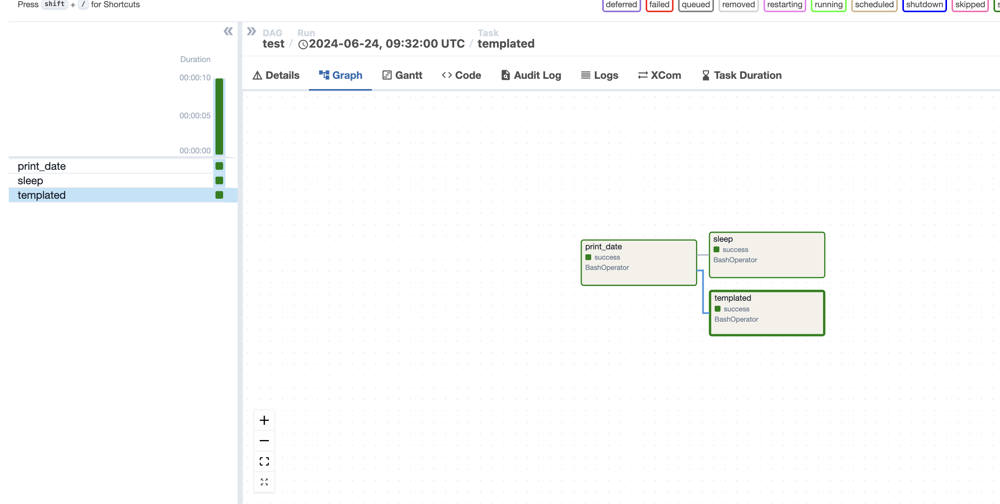
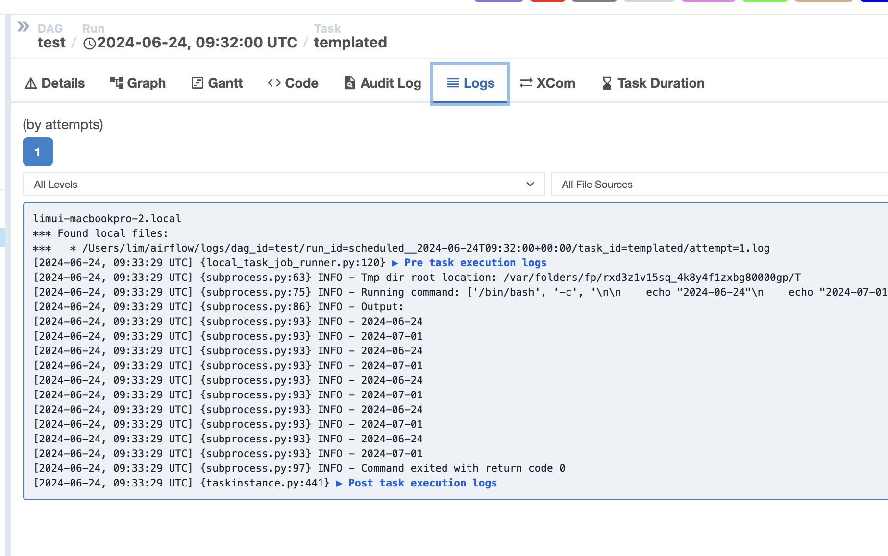

# airflow study

- 로컬에서 airflow 테스트 해보기.

### 설치
```
파이썬 가상환경 생성하여 설치

python3 -m venv airflow
source airflow/bin/activate

=====
airflow 설치

AIRFLOW_VERSION=2.9.2

# Extract the version of Python you have installed. If you're currently using a Python version that is not supported by Airflow, you may want to set this manually.
# See above for supported versions.
PYTHON_VERSION="$(python -c 'import sys; print(f"{sys.version_info.major}.{sys.version_info.minor}")')"

CONSTRAINT_URL="https://raw.githubusercontent.com/apache/airflow/constraints-${AIRFLOW_VERSION}/constraints-${PYTHON_VERSION}.txt"
# For example this would install 2.9.2 with python 3.8: https://raw.githubusercontent.com/apache/airflow/constraints-2.9.2/constraints-3.8.txt

pip install "apache-airflow==${AIRFLOW_VERSION}" --constraint "${CONSTRAINT_URL}"


```

### 실행

- webserver 실행
> airflow webserver

- scheduler 실행 
> airflow scheduler


### 내가 작성한 DAG를 어떻게 포함 ?

airflow.cfg를 찾아 dags_folder의 위치를 수정한다.


### 이해하기

DAG - 작업 정의 내용  => 하나의 DAG는 하나의 배치 잡과 같음

Scheduler - 작업 내용을 보고 분배하는 애. DAG를 바라보고 있음

Task - 작업 => DAG(잡)에 들어있는 태스크

Executor - 실행하는 애 


### 웹 페이지 화면





동작 잘 된다.
